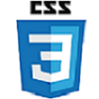

# About Me

Hi! My name is Veronica and I'm a developer. I specialize in a lot of unique skills that would be suitable for what you're looking for. I live in the Northern Atlanta area and am ready to be the newest member of your team. I was able to provide a charge detailing a lot of my skills below. My different skills cultivated throughout my three month journey into web development and the software field in general. I learned a lot of interesting things in the time at boot camp. I am ready to also expand my knowledge. Please take a look, and note that link to my GitHub and LinkedIn are available as well as links to my professional email and a posting of my resume. Please let me know if you have any questions or concerns. Thank you so much for your time!

## Hobbies Include:
- Watching nerdy stuff
- Snuggling my dogs
- Cooking

## Coding Specialities:

